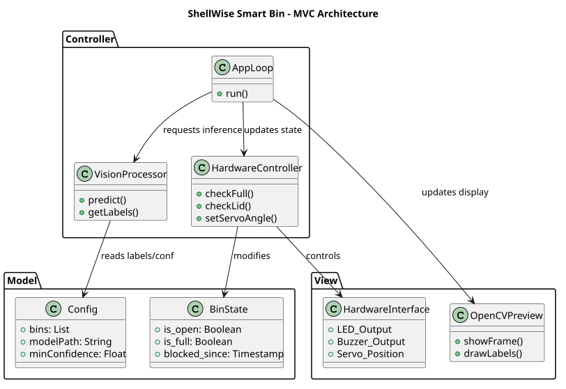
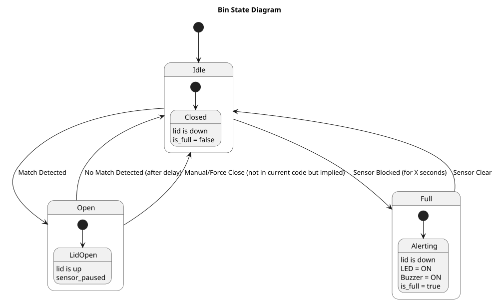
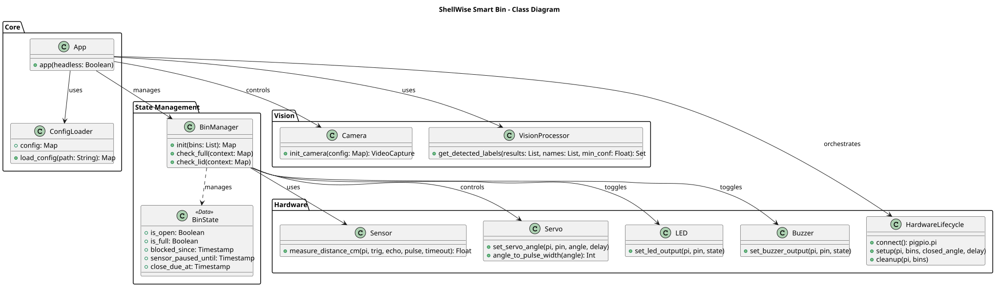
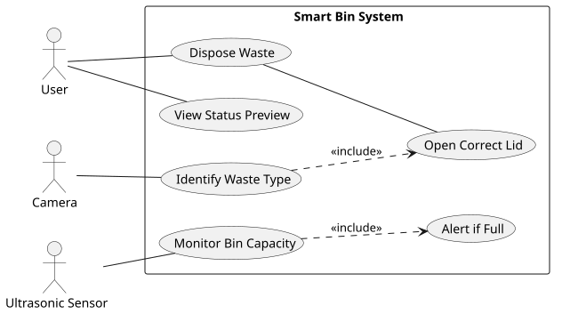

# ♻️ ShellWise Smart Bin: Edge Vision System

> **A lightweight YOLOv11n computer vision pipeline engineered for real-time PET bottle classification on localized edge hardware.**
> 
> 🏆 **1st Place Overall — Project IMPACT (Awarded by REZBIN & NU-D)**
> 🏛️ **Officially Endorsed for Regional Edge-AI Integration by DOST Calabarzon & DSWD.**

[](https://www.python.org/downloads/)
[]()
[]()
[](https://opensource.org/licenses/Apache-2.0)

## 🏛️ System Architecture
This repository contains the localized vision pipeline for the ShellWise Smart Bin. To ensure real-time physical actuation and minimal power draw, the system utilizes the `YOLOv11n` (Nano) architecture. This allows for high-throughput inference directly on constrained edge devices (Raspberry Pi 4) without requiring continuous cloud compute.
<!-- 
### 📐 Architecture Diagrams
Below are the architectural representations of the ShellWise Smart Bin system:

| **MVC Architecture** | **State Diagram** |
|:---:|:---:|
|  |  |

| **Class Diagram** | **Use Case Diagram** |
|:---:|:---:|
|  |  | -->

### Data Engineering & Provenance
The model was fine-tuned specifically for the detection of Polyethylene Terephthalate (PET) plastics to facilitate automated recycling sorting.
* **Dataset Source:** *Plastic Recyclable Detection* via [Roboflow Universe](https://universe.roboflow.com/snowman1908/plastic-recyclable-detection).
* **Target Class:** `PET-Bottles`

### Sensor Fusion & State Management
This pipeline does not rely solely on visual triggers. It employs sensor fusion by integrating an HC-SR04 Ultrasonic Sensor for physical state management. The system utilizes conditional actuation logic: the GPIO servo motors will only deploy if the YOLOv11n model detects a high-confidence `PET-Bottle` **AND** the ultrasonic sensor verifies the bin is below maximum capacity. This verifies the bin is below maximum capacity. If the bin is at maximum capacity, mechanical actuation is halted, and the system instead triggers a localized hardware alert (Active Buzzer and Red LED) to notify the user.

## ⚙️ Quick Start & Reproducibility

### Environment Setup
To ensure cross-platform stability, dependencies are modularized based on the deployment hardware.
#### **Clone the repository:**
```bash
git clone https://github.com/matlih/IMPACT-COMEX-bin.git
cd IMPACT-COMEX-bin
```

#### Edge Deployment (Raspberry Pi):
* Installs core computer vision frameworks alongside GPIO and edge-actuation libraries.
```bash
pip install -r requirements/raspberrypi.txt
```

#### Local Prototyping (Windows PC):
* Installs core computer vision frameworks optimized for local webcam testing.
```bash
pip install -r requirements/windows.txt
```

### Deployment (Execution):
* Use the Linux launcher for full edge runtime setup and execution.
```bash
chmod +x run.sh
./run.sh
```

### Windows Test Launcher (Non-Production)
* The batch launcher is kept for convenience testing only.
```bash
run.bat
```

### **Hardware**
The following are the essential hardware components:
* **Compute Module:** Raspberry Pi 4 (8gb)
* **Vision Sensor:** Standard 1080p USB Webcam
* **Actuation:** Servo MG90S for the bin lid
* **Capacity State Sensor:** HC-SR04 Ultrasonic Sensor. Engineered as a hardware failsafe to halt servo actuation when the bin reaches maximum physical capacity, regardless of YOLO inference triggers.
* **Active Buzzer:** Produces a buzz sound when the camera detects `PET-Bottle`, but the HC-SR04 Ultrasonic Sensor detects that the bin is full.
* **Red LED**: Lights up when the camera detects `PET-Bottle`, but the HC-SR04 Ultrasonic Sensor detects that the bin is full.

## 📊 MLOps & Training Metrics
*The core vision model was trained in a cloud-compute environment (Google Colab, NVIDIA T4) before NCNN compilation. The metrics below reflect the performance of the YOLOv11n architecture at Epoch 30, optimized at a 320x320 image size for maximum edge-inference speed.*

* **Mean Average Precision (mAP@50):** 97.6%
* **Precision:** 94.9%
* **Recall:** 93.4%

> **Note:** A precision of 94.9% ensures high-fidelity motor actuation, drastically minimizing false-positive sorting errors in the physical bin mechanism.

## 🛡️ Project Engineering Team
* Montazar L. Matlih — Machine Learning Engineer
* John Christian R. Senoto — Embedded Systems Engineer
